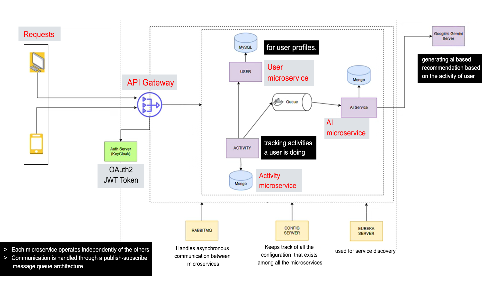

# Activity Microstack 🏋️‍♂️

A modular, Spring Boot-based microservices platform for tracking user activities and delivering AI-powered recommendations. This project is designed with scalability and security in mind, leveraging a modern, cloud-native tech stack.

## Key Features

- **Modular Microservices Architecture:** Each component is a separate service, allowing for independent development, deployment, and scaling.
- **AI-Powered Recommendations:** Integrates with **Google Gemini AI** to provide users with personalized activity suggestions.
- **Secure by Design:** Uses **Keycloak** for robust OAuth2/OpenID Connect authentication and authorization across all services.
- **Asynchronous Communication:** Leverages **RabbitMQ** for resilient, non-blocking communication between services.
- **Centralized Configuration:** Manages all service configurations from a single **Spring Cloud Config Server**.
- **Modern Frontend:** A responsive and interactive UI built with **React.js**.

## System Architecture

The platform follows a standard microservices pattern. External requests from the React frontend are routed through the **API Gateway**, which handles authentication and forwards requests to the appropriate internal service. Services are registered with the **Eureka Discovery Server**, allowing them to locate and communicate with each other dynamically.



### 🧩 Microservices Overview

| Service              | Description                                                              |
| -------------------- | ------------------------------------------------------------------------ |
| `user-service`       | Manages user profiles and syncs with Keycloak. Uses **PostgreSQL**.      |
| `activity-service`   | Tracks user activities. Stores activity data in **MongoDB**.             |
| `ai-service`         | Generates recommendations using **Google Gemini AI**. Stores in **MongoDB**. |
| `discovery-service`  | Eureka Server for microservice registration and discovery.               |
| `api-gateway`        | Entry point for routing external requests to internal services.          |
| `config-server`      | Centralized configuration management using Spring Cloud Config.          |
| `frontend`           | React-based UI for user interaction with the platform.                   |

## 🛠️ Tech Stack

| Category                   | Technologies                                                                    |
| -------------------------- | ------------------------------------------------------------------------------- |
| **Backend**                | Java 17/21, Spring Boot 3, Spring Cloud, Spring WebClient                       |
| **Frontend**               | React.js, Vite, Material-UI, Redux Toolkit, npm                                 |
| **Databases**              | PostgreSQL (User data), MongoDB (Activity & AI data)                            |
| **Security**               | Keycloak (OAuth2 / OpenID Connect), JWT                                         |
| **Messaging**              | RabbitMQ                                                                        |
| **AI Engine**              | Google Gemini AI                                                                |
| **Build & Orchestration**  | Maven, Docker, Docker Compose                                                   |

---

## 🚀 Getting Started

Follow these instructions to get the application running on your local machine.

### ✅ Prerequisites

- Java 17+ (Java 21 recommended)
- Node.js 18+ and npm
- Docker & Docker Compose
- Maven 3.8+
- Git

### ⚙️ Installation

1. **Clone the repository:**
   ```bash
   git clone https://github.com/pratikpaudel/activity-microstack
   cd activity-microstack
   ```

2. **Configure Environment Variables:**
   This project requires credentials for databases, RabbitMQ, and the Google Gemini AI API key. The recommended approach is to create a `.env` file in the root directory for Docker Compose to use. See the `🔧 Configuration` section below for details on the required variables.

---

## 🏃‍♀️ Running the Application

Follow these steps if you prefer to run services individually on your host machine.

#### 1. Start Infrastructure Services

You need to have PostgreSQL, MongoDB, and RabbitMQ running. You can use Docker or a local installation.

**PostgreSQL:**
```bash
# Using Docker
docker run --name postgres-fitness -e POSTGRES_PASSWORD=password -e POSTGRES_DB=fitness_db -p 5432:5432 -d postgres:latest
```

**MongoDB:**
```bash
# Using Docker
docker run --name mongodb-fitness -p 27017:27017 -d mongo:latest
```

**RabbitMQ:**
```bash
# Using Docker
docker run --name rabbitmq-fitness -p 5672:5672 -p 15672:15672 -d rabbitmq:management
```

#### 2. Start Backend Services

Start the Spring Boot services in the following order. Open a new terminal for each command.

```bash
# 1. Config Server
cd configserver
mvn spring-boot:run

# 2. Eureka Server
cd ../eureka
mvn spring-boot:run

# 3. User Service
cd ../userservice
mvn spring-boot:run

# 4. Activity Service
cd ../activityservice
mvn spring-boot:run

# 5. AI Service
cd ../aiservice
mvn spring-boot:run

# 6. API Gateway
cd ../gateway
mvn spring-boot:run
```

#### 3. Start the Frontend
```bash
# Navigate to the frontend directory
cd fitness-app-frontend

# Install dependencies
npm install

# Start the development server
npm run dev
```

The frontend will be available at `http://localhost:5173`.

## 🔧 Configuration

### Environment Variables

For manual setup, ensure these environment variables are set in your shell. For Docker Compose, create a `.env` file in the project root with the following content:

```env
# Database Configuration
SPRING_DATASOURCE_URL=jdbc:postgresql://localhost:5432/fitness_db
SPRING_DATASOURCE_USERNAME=postgres
SPRING_DATASOURCE_PASSWORD=password

# MongoDB Configuration
SPRING_DATA_MONGODB_URI=mongodb://localhost:27017/fitness

# RabbitMQ Configuration
SPRING_RABBITMQ_HOST=localhost
SPRING_RABBITMQ_PORT=5672
SPRING_RABBITMQ_USERNAME=guest
SPRING_RABBITMQ_PASSWORD=guest

# Eureka Configuration
EUREKA_CLIENT_SERVICEURL_DEFAULTZONE=http://localhost:8761/eureka/

# Config Server Configuration
SPRING_CLOUD_CONFIG_URI=http://localhost:8888

# Google Gemini AI API Key
GEMINI_API_KEY=your-google-gemini-api-key
```

### Keycloak Configuration

The API Gateway and other services are secured with Keycloak. Configuration is managed in the config-server. You will need to set up a Keycloak realm, client, and users. The properties look like this:

```yaml
spring:
  security:
    oauth2:
      client:
        provider:
          keycloak:
            issuer-uri: http://localhost:9090/realms/activity-microstack
      resourceserver:
        jwt:
          issuer-uri: http://localhost:9090/realms/activity-microstack
```

## 📋 Service Ports

| Service           | Port | Description                |
| ----------------- | ---- | -------------------------- |
| Eureka Server     | 8761 | Service discovery          |
| Config Server     | 8888 | Configuration management   |
| API Gateway       | 8080 | Main entry point          |
| User Service      | 8081 | User management            |
| Activity Service  | 8082 | Activity tracking          |
| AI Service        | 8083 | AI recommendations         |
| Frontend (Vite)   | 5173 | React application          |
| RabbitMQ Mgmt     | 15672| Message broker UI          |

## 📚 API Documentation

(Endpoints are accessed through the API Gateway at `http://localhost:8080`)

### User Service

- `POST /api/users/register` - Register a new user.
- `GET /api/users/{id}` - Get user details by ID.

### Activity Service

- `POST /api/activities` - Create a new activity.
- `GET /api/activities/user/{userId}` - Get all activities for a user.

### AI Service

- `POST /api/ai/recommendations` - Generate and retrieve AI recommendations for the authenticated user.

## 🧪 Testing

To run the backend tests for all modules:

```bash
mvn test
```

To run frontend tests:

```bash
cd fitness-app-frontend
npm test
```

## 🤝 Contributing

Contributions are welcome! Please follow these steps:

1. Fork the repository.
2. Create a new feature branch (`git checkout -b feature/your-amazing-feature`).
3. Commit your changes (`git commit -m 'Add some amazing feature'`).
4. Push to the branch (`git push origin feature/your-amazing-feature`).
5. Open a Pull Request.